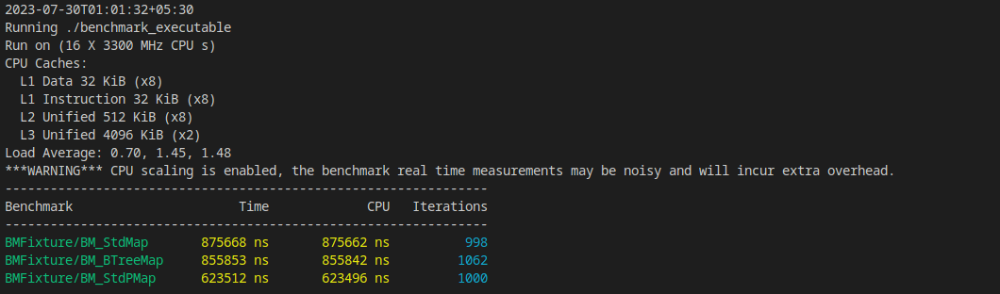

# Ordered Maps
Benchmarked ordered maps to check for performance in maintaining an orderbook.

The containers being benchmarked are 
- std::map
- absl::btree_map
- std::map with boost pool allocator

Each container is initialized with a starting set of 20 orders, the snapshot. \
The container receives data from the updates.csv to resemble the market data updates sent from the exchange.\
The size of the orderbook, the container, is constant throughout. \

The number of operations of each type is:

- Insertions: 2542
- Deletions:2544
- Updates:4914

The operations were performed in a random order as generated by generate_mktdata.cc 

The results of the benchmark are:



command to build: 
```g++ -o benchmark_executable BM_ordered.cpp -O3 -lbenchmark -lpthread```
