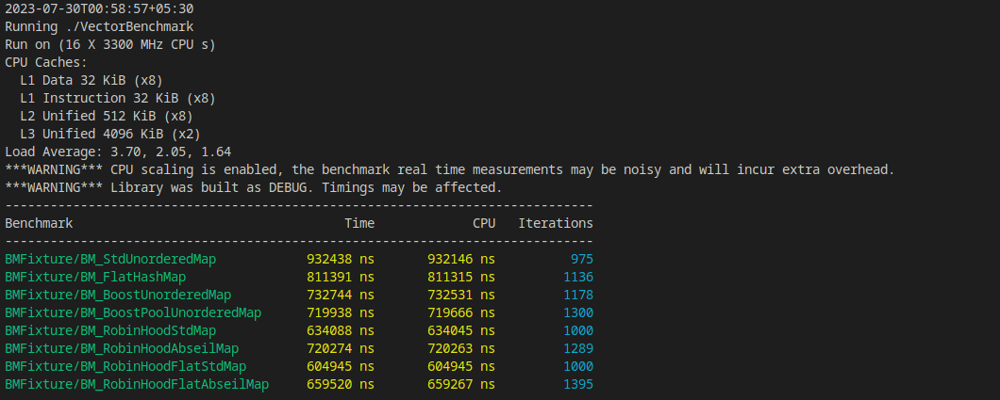

# Unordered Maps
Benchmarked several unordered maps to check their performance in receiving and storing market data updates from the exchange

The containers being benchmarked are 
- std::unordered_map
- absl::flat_hash_map
- boost::unordered_map
- boost::unordered_map with boost pool allocator
- robinhood::unordered_node_map with std::hash
- robinhood::unordered_node_map with absl::hash
- robinhood::unordered_flat_map with std::hash
- robinhood::unordered_flat_map with absl::hash 

Each container is initialized with a starting set of 5000 orders. \
The container receives data from the updates.csv to resemble the market data updates sent from the exchange.\

The number of operations of each type is:

- Insertions:4192
- Deletions:1019
- Updates:4789

The operations were performed in a random order as generated by generate_mktdata.cc 

The results of the benchmark are:

The CMakeLists.txt to build the binary is attached.
